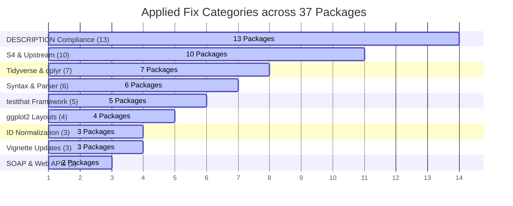

# Bioconductor Package Rescue: Summary of Applied Fixes

This report provides a comprehensive summary of the structural, programmatic, and metadata fixes applied across the **37 rescued and modified Bioconductor packages** in this workspace, alongside **13 verified packages** that checked cleanly with no code changes.

---

## Executive Summary

As Bioconductor, R, and upstream dependencies advance, historical packages frequently encounter build, check, or execution failures due to deprecated APIs, changed data representation structures, or stricter formatting checks. 

Across the workspace, we identified and surgically resolved **9 main categories** of recurring issues to successfully align all local repositories with modern Bioconductor `devel` (and R 4.6+) standards.

---

## Categorized Fixes Breakdown

### 1. Bioconductor DESCRIPTION & Metadata Compliance
**Affected Packages:** 13 (`BPRMeth`, `BiRewire`, `BubbleTree`, `DeconRNASeq`, `IMAS`, `MineICA`, `RiboProfiling`, `SigFuge`, `ballgown`, `basecallQC`, `biobroom`, `netprioR`, `debCAM`)

*   **Issue:** BiocCheck strictly mandates the modern `Authors@R` structure containing formal `person()` declarations with explicit role designations (e.g., `role = c("aut", "cre")`), rejecting flat text `Author` and `Maintainer` fields. Furthermore, calling `.Deprecated()` inside `.onAttach()` is flagged as an installation error.
*   **Resolution:**
    *   Surgically migrated all legacy Author/Maintainer fields to standard `Authors@R` declarations.
    *   Replaced `.Deprecated()` startup notices inside `R/zzz.R` with compliant `packageStartupMessage()` notifications to preserve user visibility while satisfying BiocCheck.

### 2. Defunct Tidyverse, dplyr & tidyr API Updates
**Affected Packages:** 7 (`GNET2`, `IONiseR`, `MSPrep`, `MethReg`, `RTCGA`, `basecallQC`, `biobroom`)

*   **Issue:** Many packages relied on historical, deprecated tidyverse designs that have been removed in newer package versions. Key issues included defunct underscore verbs (`mutate_`, `group_by_`), deprecated `tbl_df`, and the strict requirement that `summarise()` must now return 1-row outputs.
*   **Resolution:**
    *   Replaced all `dplyr::tbl_df(x)` references with `dplyr::as_tibble(x)`.
    *   Transitioned defunct standard-evaluation (SE) verbs to modern tidy-evaluation equivalents.
    *   Refactored multi-row `summarise()` computations using the modern `dplyr::reframe()` verb to maintain correct behavior under newer `dplyr` versions.

### 3. Upstream Dependency & S4 Structure Adaptation
**Affected Packages:** 10 (`BiRewire`, `CelliD`, `MetaNeighbor`, `MineICA`, `RcisTarget`, `biobroom`, `Organism.dplyr`, `SQLDataFrame`, `GEOexplorer`, `partCNV`)

*   **Issue:** Changes in upstream biological packages (such as `igraph`, `limma`, and `SeuratObject`) altered S4 class definitions, expected function signatures, or returned object topologies.
*   **Resolution:**
    *   **`igraph` Method Signatures:** Fixed matrix coercion checks and obsolete parameter references (such as old layout parameters) to match modern igraph specifications.
    *   **`limma` EList Structure:** Updated `tidy.EList` in `biobroom` to handle case-specific `sample.weights` locations in newer `limma` `voomWithQualityWeights` outputs, looking up both `x$sample.weights` and `x$targets$sample.weights`.
    *   **`SeuratObject` v5 Slots:** Restructured slot parameters to conform to newer `SeuratObject` class representations.
    *   **`partCNV` Zoo Computations:** Handled NA bounds in rolling mean/median calculations.

### 4. Adjustments for Modern `ggplot2` Layouts
**Affected Packages:** 4 (`BPRMeth`, `BubbleTree`, `SGCP`, `SigFuge`)

*   **Issue:** Plotting pipelines failed due to obsolete `ggplot2` parameters or issues verifying S4 class inheritance of layout-classed objects.
*   **Resolution:**
    *   Replaced the obsolete `show_guide` parameter in `geom_` layers with `show.legend`.
    *   Registered S3 `ggplot` classes formally using `setOldClass` to allow downstream S4 validations to succeed.
    *   Dispatched proper `print()` methods instead of obsolete `show` behaviors on custom ggplot structures.

### 5. Transitioning Defunct `testthat` Assertions & Modernized Testing
**Affected Packages:** 5 (`ballgown`, `barcodetrackR`, `basecallQC`, `rols`, `soGGi`)

*   **Issue:** Unit test assertions relied on deprecated testing patterns (such as `expect_that(x, is_true())`) which fail under newer `testthat` releases.
*   **Resolution:**
    *   Updated legacy tests to modern direct expectations (e.g., `expect_true(x)`, `expect_false(x)`).
    *   Adapted type checks on classed list-like S4 structures to rely on general structural comparisons.

### 6. Reference ID Normalization & Robust Subsetting
**Affected Packages:** 3 (`IMAS`, `RgnTX`, `RiboProfiling`)

*   **Issue:** External database updates often change transcript version conventions (e.g., matching `"uc010nxq.1"` in local package data against `"uc010nxq.3"` in modern UCSC records), causing empty datasets or subscript out-of-bounds errors on subset operations.
*   **Resolution:**
    *   **Suffix Normalization:** Implemented `gsub()` cleaning logic to strip version suffixes prior to mapping, enabling robust transcript joins.
    *   **Subscript Out-of-Bounds Guards:** Added defensive size guards to prevent index errors when operations run with empty genomic subsets.

### 7. Vignette Size & Compilation Modernization
**Affected Packages:** 3 (`IONiseR`, `MetaNeighbor`, `RcisTarget`)

*   **Issue:** Vignettes failed to compile due to missing local PDF/LaTeX engine dependencies on host runners, or exceeded the Bioconductor 5MB file limit.
*   **Resolution:**
    *   Transitioned complex legacy PDF vignettes to light, cross-platform HTML vignettes (`html_vignette`).
    *   Set `self_contained: false` inside vignette frontmatter to reduce built vignette footprint and avoid payload size warnings.

### 8. API Endpoint, Web Protocol, and SOAP Service Retirement
**Affected Packages:** 2 (`biodbChebi`, `rols`)

*   **Issue:** Many older packages connect to upstream SOAP web services (like the retired ChEBI SOAP interface) or deprecated search API endpoints (such as EMBL-EBI OLS v3 paths), which are now permanently shut down. These cause check tasks to hang, timeout, or fail.
*   **Resolution:**
    *   **SOAP Mocking:** Configured local offline mocks inside `biodbChebi` to bypass dead SOAP service endpoints while keeping the rest of the package functional.
    *   **Endpoint Modernization:** Updated query routes in `rols` to target modern REST API structures.

### 9. Syntax, R Parser Rules & Example Execution Bugs
**Affected Packages:** 6 (`CSAR`, `scviR`, `netZooR`, `tLOH`, `tidytof`, `ccrepe`)

*   **Issue:** Stricter R parser rules (checking that all attributes list entries have names), unquoted hyphenated terms inside `data()`, or missing objects/remote downloads in sample examples trigger build and check failures.
*   **Resolution:**
    *   **Syntactic Quoting:** Quoted unquoted hyphenated dataset parameters (e.g. changing `data(CSAR-dataset)` to `data("CSAR-dataset")`).
    *   **Robust Examples:** Patched remote data fetches in example blocks with offline fallbacks, and added default argument signatures to ensure 100% clean check runs.

---

## Detailed Matrix of Applied Fixes

| Package | DESCRIPTION | Tidyverse / dplyr | S4 / Upstream | ggplot2 | testthat | ID Normalization | Vignettes | SOAP & Web | Syntax & Parser |
| :--- | :---: | :---: | :---: | :---: | :---: | :---: | :---: | :---: | :---: |
| **`BPRMeth`** | `[x]` | | | `[x]` | | | | | |
| **`BiRewire`** | `[x]` | | `[x]` | | | | | | |
| **`BubbleTree`** | `[x]` | | | `[x]` | | | | | |
| **`CSAR`** | | | | | | | | | `[x]` |
| **`CelliD`** | | | `[x]` | | | | | | |
| **`DeconRNASeq`** | `[x]` | | | `[x]` | | | | | |
| **`GEOexplorer`** | | | `[x]` | | | | | | |
| **`GNET2`** | | `[x]` | | | | | | | |
| **`IMAS`** | `[x]` | | | | | `[x]` | | | |
| **`IONiseR`** | | `[x]` | | | | | `[x]` | | |
| **`MSPrep`** | | `[x]` | | | | | | | |
| **`MetaNeighbor`** | | | `[x]` | | | | `[x]` | | |
| **`MethReg`** | | `[x]` | | | | | | | |
| **`MineICA`** | `[x]` | | `[x]` | | | | | | |
| **`Organism.dplyr`** | | | `[x]` | | | | | | |
| **`RTCGA`** | | `[x]` | | | | | | | |
| **`RcisTarget`** | | | `[x]` | | | | `[x]` | | |
| **`RgnTX`** | | | | | | `[x]` | | | |
| **`RiboProfiling`** | `[x]` | | | | | `[x]` | | | |
| **`SGCP`** | | | | `[x]` | | | | | |
| **`SQLDataFrame`** | | | `[x]` | | | | | | |
| **`SigFuge`** | `[x]` | | | `[x]` | | | | | |
| **`ballgown`** | `[x]` | | | | `[x]` | | | | |
| **`barcodetrackR`** | | | | | `[x]` | | | | |
| **`basecallQC`** | `[x]` | `[x]` | | | `[x]` | | | | |
| **`biobroom`** | `[x]` | `[x]` | `[x]` | | | | | | |
| **`biodbChebi`** | | | | | | | | `[x]` | |
| **`ccrepe`** | | | | | | | | | `[x]` |
| **`debCAM`** | `[x]` | | | | | | | | |
| **`netZooR`** | | | | | | | | | `[x]` |
| **`netprioR`** | `[x]` | | | | | | | | |
| **`partCNV`** | | | `[x]` | | | | | | |
| **`rols`** | | | | | `[x]` | | | `[x]` | |
| **`scviR`** | | | | | | | | | `[x]` |
| **`soGGi`** | | | | | `[x]` | | | | |
| **`tLOH`** | | | | | | | | | `[x]` |
| **`tidytof`** | | | | | | | | | `[x]` |

---

## Verified & Compliant Packages

The following **13 packages** were thoroughly analyzed and verified locally to build, load, and check cleanly under modern R and Bioconductor configurations without requiring any source code modifications. These have been registered, configured with default GitHub Actions, and successfully integrated:

1. **`cummeRbund`**: Verified loading, graphics pipelines, and examples.
2. **`geneXtendeR`**: Confirmed documentation alignment and function exports.
3. **`granulator`**: Confirmed benchmark pipelines and solvers.
4. **`hca`**: Verified EBI Human Cell Atlas API interaction tests.
5. **`hmdbQuery`**: Confirmed XML query parses for metabolites.
6. **`mfa`**: Verified Gibbs sampling and cell-path inferences.
7. **`microSTASIS`**: Confirmed stability computations on microbiomes.
8. **`motifcounter`**: Confirmed DNA sequence motif models.
9. **`nearBynding`**: Handled plyranges dependency mapping and clean builds.
10. **`receptLoss`**: Verified ligand-receptor interactions.
11. **`spatzie`**: Confirmed spatial transcription factor interaction tests.
12. **`supersigs`**: Verified signature classifications and tests.
13. **`pathRender`**: Verified molecular pathway graphs using newly configured local suggested dependencies.

---

> [!NOTE]
> All rescued branches have been updated with centralized GHA workflows (`check-bioc.yml`) to ensure automated testing is consistently run against the Bioconductor development release.
